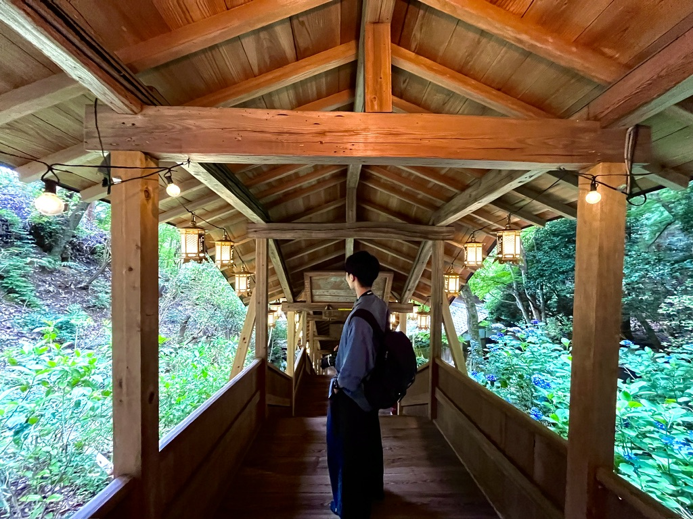

  
  <h1 style="color:white;">👋 Hello! I'm doshishaus</h1>
  
I'm a passionate developer with a love for creating beautiful and functional web applications.

  <h2 style="color:white;">About Me</h2>
  
🌟 Expertise: Web Development, HTML, CSS, SCSS, JavaScript

  
📚 Learning: React, Next.js, Node.js, PHP, Tailwind CSS, MUI, Vertex AI, MySQL, phpMyAdmin

  
🌐 Exploring: Open data in Japan

  
🏆 Achievements: Successfully implemented various projects including web applications and hackathon contributions.

  <h2 style="color:white;">My Skills</h2>
  
  
  
  
  
  
  
  
  
  
  
  
  

  <h2 style="color:white;">Projects</h2>
  

    

      <a href="https://github.com/doshishaus/classcommunity" style="color:white; text-decoration:none;"><h3>classcommunity</h3></a>
      
掲示板サイト (PHP)

    

    

      <a href="https://github.com/doshishaus/magonote1-2" style="color:white; text-decoration:none;"><h3>magonote1-2</h3></a>
      
JavaScript Project

    

    

      <a href="https://github.com/illionillion/ashiato" style="color:white; text-decoration:none;"><h3>illionillion/ashiato</h3></a>
      
ビギナーズハッカソン用リポジトリ (PHP)

    

    

      <a href="https://github.com/doshishaus/GuchiAIapp" style="color:white; text-decoration:none;"><h3>GuchiAIapp</h3></a>
      
vertexAIを使用した愚痴を生成し共有するアプリ (JavaScript)

    

    

      <a href="https://github.com/doshishaus/hackathon_team4" style="color:white; text-decoration:none;"><h3>hackathon_team4</h3></a>
      
Hackathon Project (TypeScript)

    

    

      <a href="https://github.com/doshishaus/miyazakiseminarWelcomeHP" style="color:white; text-decoration:none;"><h3>miyazakiseminarWelcomeHP</h3></a>
      
Forked HTML Project

    

  

  <h2 style="color:white;">Connect with Me</h2>
  
Feel free to explore my projects and contributions. Thank you for visiting my profile!

